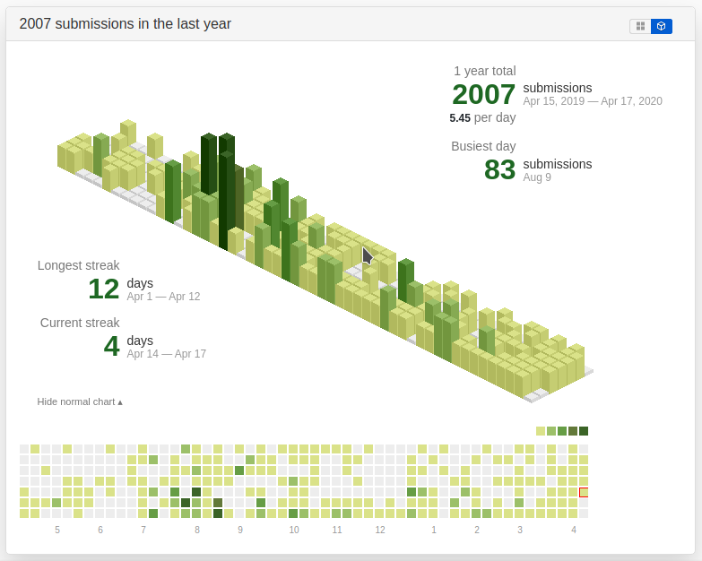

## Isometric submissions
This is an extension for Chrome that is similar to [isometric contributions](https://github.com/jasonlong/isometric-contributions). In fact,
it only works with [LeetCode](https://leetcode.com/). It allows to switch between your LeetCode submissions chart and an isometric pixel art
 version. It uses [obelisk.js](https://github.com/nosir/obelisk.js) for the isometric graphics.

Besides being sort of neat looking, this view is interesting in that
it highlights the differences between the number of submissions in the platform during
the year with more granularity. It won't certainly replace the standard 2D graph completely. Yet, it is
open for improvements in order to add more features like to get the number of daily submissions on hover over a bar.

As shown in the screenshot, the top right toggle is to toggle between the 2D and 3D view.
and the top left link is to hide/show the usual 2D chart.

### Developer mode

If you want to hack on the extension, you'll need to install it manually.
First clone or fork this repo. Then, You can follow these [steps](https://developer.chrome.com/extensions/faq#faq-dev-01).

When developing your own extension or version you may need to reload your changes
each time so I advice using this extension to reload the unpacked extensions :arrows_counterclockwise: :smirk:
[Extensions Reloader](https://chrome.google.com/webstore/detail/extensions-reloader/fimgfedafeadlieiabdeeaodndnlbhid).

Feel free to send a pull request if you've made an improvement.

### License
This project is licensed under the [MIT License](http://opensource.org/licenses/MIT).
